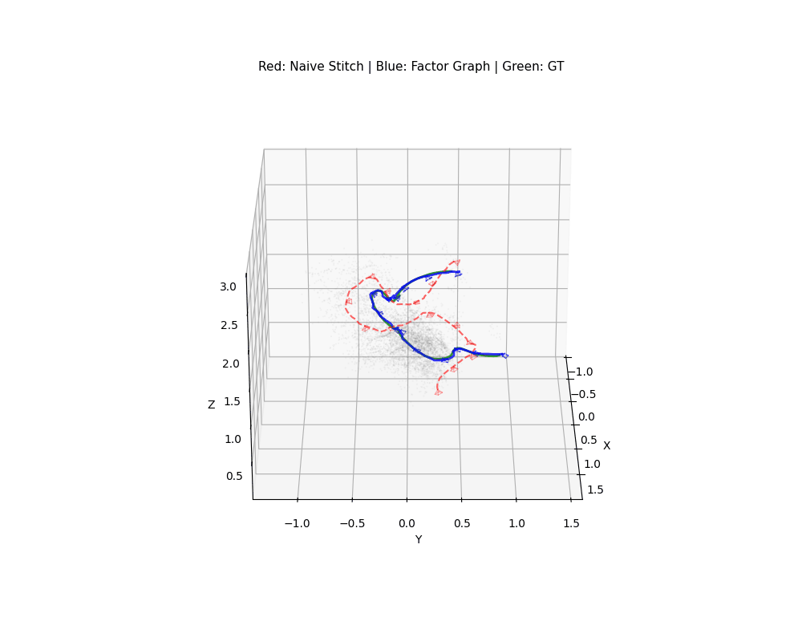
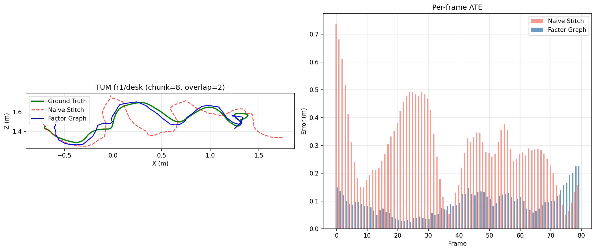
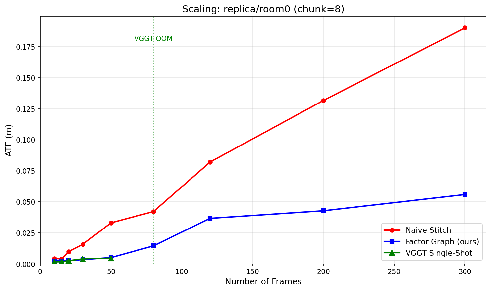
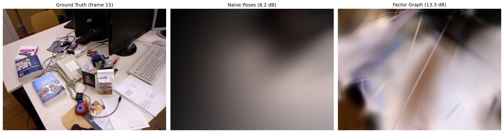

# VGGT + Factor Graph Refinement

**Foundation models give you a great initialization. Factor graphs give you global consistency.**

VGGT predicts camera poses from images in a single forward pass, but it can only process ~15-30 frames at once (24GB GPU). For longer videos, you must chunk and stitch. Naive stitching accumulates drift at chunk boundaries.

This project adds a GTSAM factor graph on top of VGGT to enforce global consistency across chunks:
- Within-chunk odometry factors (tight, since VGGT is accurate locally)
- Cross-chunk overlap constraints with Cauchy robust kernel
- Visual loop closure via ORB feature matching
- LM optimization produces globally consistent trajectory

## Demo

3D point cloud with camera frustums on TUM fr1/desk. Green = ground truth, blue = factor graph (ours), red = naive stitching. The factor graph trajectory closely follows ground truth while naive stitching drifts.



## Results

### Pose Accuracy (TUM-RGBD, 80 frames, chunk_size=8)

**fr1/desk: 89.4% ATE reduction**



| Sequence | Naive Stitch ATE | Factor Graph ATE | Improvement |
|----------|-----------------|------------------|-------------|
| fr1/desk | 0.2905 m | **0.0309 m** | **89.4%** |
| fr1/xyz | 0.1416 m | **0.0599 m** | **57.7%** |
| fr1/room | 0.1820 m | **0.0852 m** | **53.2%** |
| fr2/desk | 0.0896 m | **0.0346 m** | **61.4%** |
| fr3/office | 0.1259 m | **0.0487 m** | **61.3%** |

Average improvement: **64.6%** across all 5 TUM sequences.

### Replica Dataset (80 frames, chunk_size=8)

| Sequence | Naive Stitch ATE | Factor Graph ATE | Improvement |
|----------|-----------------|------------------|-------------|
| office0 | 0.4845 m | **0.1043 m** | **78.5%** |
| office1 | 0.2163 m | **0.0675 m** | **68.8%** |
| room0 | 0.5231 m | **0.0819 m** | **84.3%** |
| room1 | 0.3968 m | **0.0782 m** | **80.3%** |

Average improvement: **78.0%** across 4 Replica scenes.

### Scaling: VGGT Single-Shot vs Chunked + Factor Graph

VGGT single-shot gives the best accuracy but OOMs past ~50 frames on 24GB. Our factor graph pipeline scales to any sequence length while staying close to the single-shot upper bound.



| Frames | VGGT Single-Shot | Naive Stitch | Factor Graph (ours) |
|--------|-----------------|-------------|-------------------|
| 10 | 0.002 m | 0.004 m | 0.003 m |
| 30 | 0.004 m | 0.016 m | 0.004 m |
| 50 | 0.005 m | 0.033 m | 0.005 m |
| 80 | OOM | 0.042 m | **0.015 m** |
| 200 | OOM | 0.132 m | **0.043 m** |
| 300 | OOM | 0.190 m | **0.056 m** |

At 300 frames, the factor graph achieves 3.4x lower error than naive stitching, and it keeps scaling.

### Gaussian Splatting Render Quality

Better poses lead to better 3D reconstruction. Gaussians trained with factor graph poses produce sharper renders:



| Metric | Naive Poses | Factor Graph Poses | Improvement |
|--------|-----------|-------------------|-------------|
| Mean PSNR | 8.16 dB | **13.28 dB** | **+5.12 dB** |
| Training loss | ~0.50 (stuck) | ~0.16 (converged) | 3x lower |

The naive poses have too much drift for the Gaussians to converge. Factor graph poses are accurate enough for the splatting to produce recognizable renders.

## How It Works

```
Long video (100+ frames)
    |
    v
[Split into chunks of 8-15 frames]
    |
    v
[VGGT per chunk] --> local poses + depth + 3D point maps
    |
    v
[Naive stitch via overlap alignment] --> initial global trajectory
    |
    v
[Build GTSAM factor graph]
  - Within-chunk odometry (tight noise, VGGT is good locally)
  - Cross-chunk overlap constraints
  - Loop closures (ORB matching for verification, Cauchy robust kernel)
    |
    v
[Levenberg-Marquardt optimization] --> refined global trajectory
    |
    v
[Initialize Gaussians from VGGT point maps]
[Train with gsplat using refined poses]
    |
    v
Output: globally consistent poses + 3D Gaussian splat reconstruction
```

## Quick Start

```bash
# Install dependencies
pip install gtsam gsplat torch
cd ~ && git clone https://github.com/facebookresearch/vggt && cd vggt && pip install -e .
cd ~ && git clone https://github.com/jashshah999/vggt-factor-refinement && cd vggt-factor-refinement

# Benchmark on TUM-RGBD (downloads data automatically)
python benchmark_chunked.py --seq fr1/desk --chunk-size 8 --overlap 2

# Gaussian splatting comparison
python benchmark_gs.py --seq fr1/desk --train-iters 500

# Run on your own video
python run.py --video my_video.mp4 --output output/
```

## Why Factor Graphs?

VGGT processes each chunk independently with no mechanism to enforce that:
1. Overlapping frames from different chunks agree on 3D positions
2. The trajectory forms a consistent loop when revisiting locations
3. Chunk boundaries are smooth (no jumps)

A factor graph provides all three. It takes VGGT's output as initial estimates and soft constraints, then optimizes for global consistency. The optimization adds ~2s of compute on top of VGGT inference.

## Requirements

- CUDA GPU with 24GB+ VRAM (for VGGT)
- Python 3.10+
- GTSAM, gsplat, PyTorch, VGGT

## License

MIT
